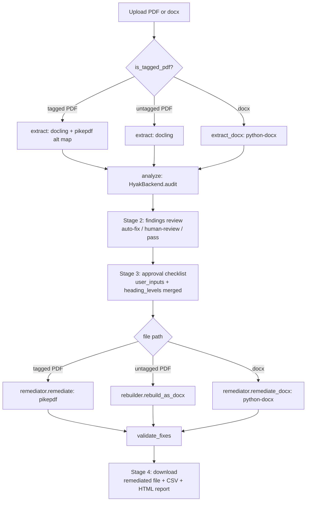
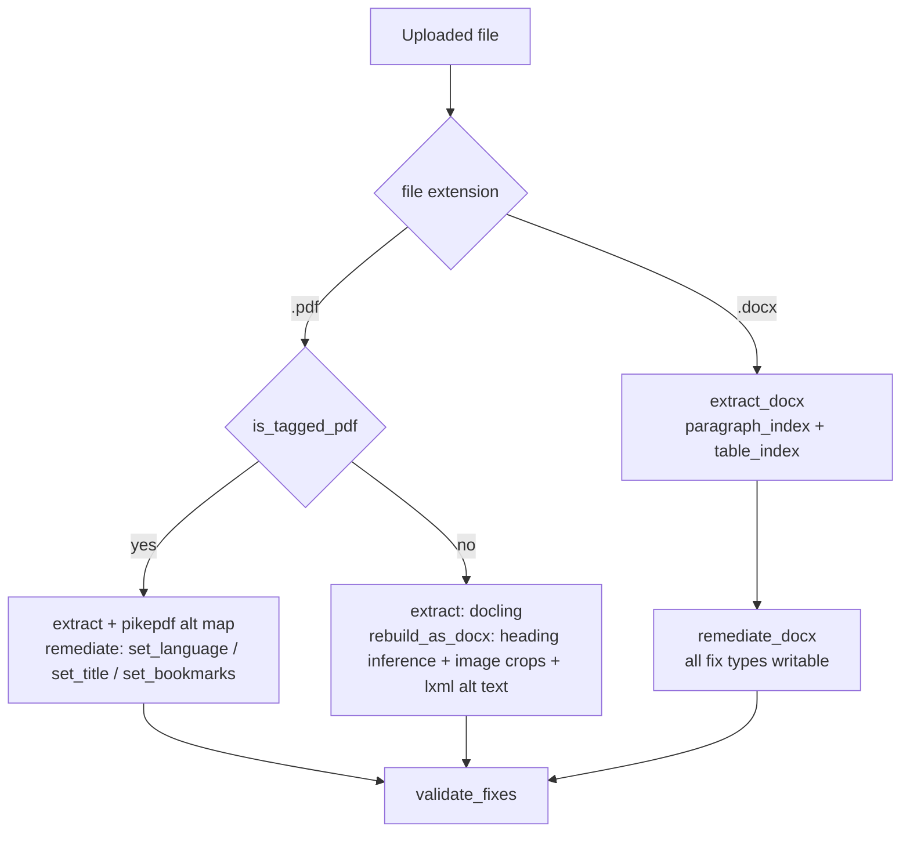
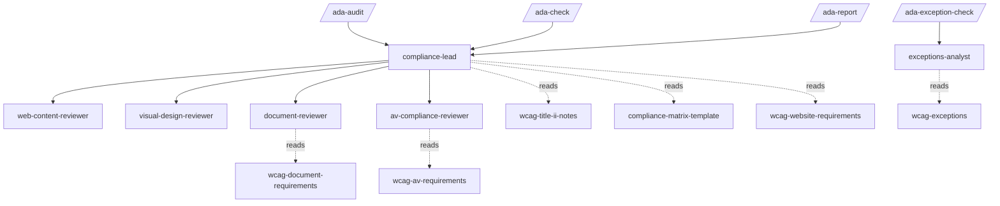

# Architecture

## 1. Overview

This repository contains two independent products. The **ADA PDF Tool** (`ada-pdf-tool/`) is a Streamlit web application for auditing and remediating accessibility issues in PDF and Word documents. The **ADA Compliance Plugin** (`plugins/ada-compliance/`) is a Claude Code plugin for auditing code repositories via slash commands. They share the same WCAG knowledge base and compatible output schemas but have no runtime code dependency on each other.

Both products follow the same design principle: audit first, surface every finding with reasoning, require explicit human approval before any file is written or change is applied. This principle exists because a naive broad-prompt approach was tested and found to silently remove manually-entered alt text and worsen accessibility scores. The human gate is non-negotiable.

---

## 2. ADA PDF Tool: Pipeline

### Layer 1: Extraction (`core/extractor.py`)

`extract()` uses docling with OCR disabled and table structure enabled. For each element, docling assigns one of these labels: `title`, `section_header`, `text`, `paragraph`, `caption`, `footnote`, `page_header`, `page_footer`, `list_item`, `code`, `formula`, `picture`, `table`. Every text element dict contains: `id`, `type`, `docling_label`, `text`, `font_size`, `font_bold`, `bbox`, `current_tag`. Image elements contain: `id`, `type`, `docling_label`, `bbox`, `has_alt_text`. Table elements contain: `id`, `type`, `docling_label`, `rows`, `cols`, `has_header_row`, `table_index`, `cells` (a list-of-lists of cell text). `has_alt_text` for images is resolved by walking the PDF's `/StructTreeRoot` via pikepdf and checking for non-empty `/Alt` attributes on `/Figure` elements.

`extract_docx()` uses python-docx. It adds `paragraph_index` to text and image elements and `table_index` to table elements — both are the direct integer index into `doc.paragraphs` and `doc.tables` respectively. These indices are used downstream by the remediator for deterministic paragraph targeting. `extract_docx()` emits the same top-level schema as `extract()`: `{file_type, metadata, pages}`.

pymupdf (fitz) is used exclusively for `render_element_thumbnail()`, which crops a PDF region and returns PNG bytes. Docling uses PDF bottom-left coordinates (`[l, t, r, b]` where `t > b`); pymupdf uses top-left. The conversion is: `pymupdf_y0 = page_height - t`, `pymupdf_y1 = page_height - b`.

`is_tagged_pdf()` opens the PDF with pikepdf and checks for `/StructTreeRoot` in the PDF root. The boolean result is exposed in the extraction dict as `has_tag_tree` and cached in `st.session_state.is_tagged_pdf` so downstream stages can branch on it without re-opening the file.

### Layer 2: LLM Analysis (`core/analyzer.py`, `core/backends/hyak_backend.py`, `prompts/`)

The extraction dict is serialized as JSON and injected into `audit_user.md` via `{{EXTRACTION_JSON}}` substitution. The system prompt (`audit_system.md`) instructs the LLM to return only a JSON object with three keys: `findings`, `preserve`, `metadata_fixes`. Each finding contains: `element_id`, `page`, `wcag_criterion`, `severity`, `classification`, `confidence`, `current_state`, `proposed_fix`, `reasoning`, `element_subtype`, `human_prompt`, `verification_path`, `check_type`, `sub_criterion`. The LLM is given the full sub-criterion taxonomy (see Section 5) and is required to select a matching row for every finding. Hallucination is constrained by: a structured input with explicit element IDs, a strict JSON-only output requirement, and the human approval gate that prevents any finding from being acted on without review.

`HyakBackend.audit()` deserializes the response into `Finding` objects. `check_type` and `sub_criterion` are defined on the `Finding` dataclass but are not currently mapped in the backend's deserialization loop — they are returned by the LLM but silently dropped. `analyze()` then splits findings into four buckets on `finding.classification`: `auto_fix`, `human_review`, `preserve_findings`, `info`.

If `file_type` is `"docx"`, the system prompt instructs the LLM to classify structural findings (`1.3.1` headings, `1.1.1` alt text, table headers) as `auto-fix` with high confidence rather than `human-review`, because python-docx can write these fixes. If `file_type` is `"pdf"`, structural findings stay `human-review`.

### Persistent PDF viewer (Streamlit sidebar)

`app.py` imports `streamlit_pdf_viewer` and renders the uploaded PDF as a persistent sidebar viewer that stays visible across all four stages. This lets users cross-reference the original document while reviewing findings and entering alt text without switching windows. The viewer is initialized in Stage 1 after upload and is not re-rendered on stage transitions.

### Layer 3: Human Approval Gate (Streamlit Stages 2–3)

Stage 2 presents findings in three sections: auto-fixable (collapsed tiles with current state, proposed fix, WCAG criterion), human-review-required (tiles with optional input fields for alt text; formula elements get the specific equation prompt from `human_prompt`), and already-correct. User-supplied alt text is stored in `st.session_state.user_inputs` keyed by `element_id`. Heading level selections are stored in `st.session_state.heading_levels`.

Stage 3 shows every proposed fix as a checklist before anything is written. High-confidence fixes are checked by default; medium-confidence are unchecked. The user clicks Apply, which collects `approved_fixes` (a list of fix dicts) from the checked items. `user_inputs` and `heading_levels` are merged into each fix dict before being passed downstream.

### Layer 4: Remediation

Three paths, determined by `is_tagged_pdf()` and file extension:

**Tagged PDF** — `remediator.remediate()`: pikepdf handles `set_language` (writes `pdf.Root.Lang`), `set_title` (writes `pdf.docinfo["/Title"]` and XMP), `set_bookmarks` (writes `pdf.open_outline()`). Fix types `heading_tag`, `alt_text`, `link_tag`, `table_header` are skipped with an explanation — writing into the tag tree is not yet implemented.

**Untagged PDF** — `rebuilder.rebuild_as_docx()`: pre-scans for a `title` or `page_header` element to hoist as the document title. Iterates all elements in page order, skipping page footers, deduplicating recurring page headers. `section_header` and body text matching heading patterns are promoted to heading styles via `_infer_heading_level()`, which matches Roman numeral prefixes (→ H1), capital-letter prefixes (→ H2), digit prefixes (→ H3), and ALL-CAPS short text (→ H1). Images and formulas are extracted as PNG crops via `_crop_region_as_image()` or `_extract_page_images()`; alt text is written to the drawing element's `docPr` XML attribute via `_set_picture_alt_text()` using lxml. Tables are written from the `cells` grid; fallback to image crop if no structured data.

**docx** — `remediator.remediate_docx()`: uses `paragraph_index` and `table_index` to target elements deterministically. Handles: `set_language`, `set_title`, `set_heading_style` (applies `Heading N` style), `set_alt_text` (writes `descr` attribute on `docPr` drawing element via lxml), `set_table_header` (applies `Table Header` style to first row).

`validate_fixes()` re-opens the output file after writing and confirms: for PDF — `Lang` attribute present, `/Title` in docinfo, `/Outlines` with entries; for docx — `descr` on drawing elements, at least one `Heading` style present.

### Layer 5: Output (`core/diff_reporter.py`)

`generate_diff_report()` reads actual before-state metadata from the original PDF via pikepdf (title, language, bookmarks presence), computes after-state from `audit_report.metadata_fixes` and `applied_fixes`, and generates a self-contained HTML file with: summary counts, before/after metadata table, all findings table, manual-remediation-required items, and optional exception notice. Output file is written to `tests/eval/sample_pdfs/`.

Three downloadable outputs from Stage 4: remediated file (PDF or docx), audit CSV (`resource, page, wcag_criterion, severity, issue, proposed_fix, status, confidence, verification_path`), HTML diff report.

---

## 3. ADA PDF Tool: Input Routing

**Tagged PDF path.** `is_tagged_pdf()` opens the file with pikepdf and checks `pdf.Root.get("/StructTreeRoot")`. If present, the tool can write directly into the existing file. pikepdf supports writing: document language (`/Lang`), document title (docinfo and XMP), and bookmarks (`/Outlines`). It cannot currently write semantic structure tags (heading tags, alt text in `/StructTreeRoot`, link tags) — this requires traversing and modifying the tag tree, which is not yet implemented. Structural findings on tagged PDFs are reported but marked as requiring manual remediation in Acrobat.

**Untagged PDF path.** No tag tree to write into. The rebuild approach produces a structured Word document that the user re-exports as a tagged PDF. `rebuild_as_docx()` runs a pre-scan over all pages to find the first `title` or qualifying `page_header` element (non-numeric, length > 5) and hoists it as the document title paragraph. Page footers are always dropped. Recurring page headers are deduplicated via `seen_page_headers`. Body text elements are promoted to headings when they match Roman numeral / capital-letter / digit patterns or are ALL-CAPS short text. Image extraction tries `_extract_page_images()` first (embedded images), falling back to `_crop_region_as_image()` (bbox crop). Alt text is written via lxml to the `docPr[@descr]` attribute. Tables without a structured `cells` grid fall back to image crops. A user can optionally upload the original source docx alongside the PDF; when provided, it gives `dispatch.py` a more faithful starting document.

Known fidelity gaps: multi-column layouts reflow to single-column; page numbers and running headers are filtered but may occasionally appear as section identifiers; EXPERIMENT IV-A page header is a known case that does not appear in rebuilt output.

**Content fidelity check.** After `rebuild_as_docx()` completes, Stage 4 calls `verify_content_fidelity(original_extraction, rebuilt_docx_path)`. This compares text blocks from the original extraction dict against paragraphs in the rebuilt Word document, computing a `match_percentage`. Results are shown as a success/warning/error banner: ≥ 90% match → success; 70–90% → warning; < 70% → error. Missing text blocks are listed so the user can inspect them before downloading. The check is untagged PDF path only and is skipped with a caption if it raises an exception.

**Perceptual hash verification.** `_image_phash()` in `rebuilder.py` computes a simple perceptual hash (average hash of a downscaled grayscale image) for inserted image crops. When an image element is processed, the hash of the source region crop is compared against the hash of the bytes written into the docx. A mismatch indicates an insertion failure and logs a warning. This catches cases where `_extract_page_images()` returns a different embedded image than the bbox crop would produce.

**docx path.** The most complete remediation path because heading levels, language, and title are all writable in-place. `paragraph_index` (integer index into `doc.paragraphs`) makes element targeting deterministic even when text content is non-unique. `table_index` (integer index into `doc.tables`) similarly targets table header fixes. Alt text is written to `docPr[@descr]` on the drawing element using lxml's element tree traversal.

---

## 4. ADA PDF Tool: Data Models (`core/models.py`)

**`Finding`** — one accessibility issue returned by the LLM:

| Field | Type | Source |
|---|---|---|
| `element_id` | str | LLM (references extractor-assigned ID) |
| `page` | int | LLM |
| `wcag_criterion` | str | LLM (e.g. "1.3.1") |
| `severity` | str | LLM: critical / serious / moderate / minor |
| `classification` | str | LLM: auto-fix / human-review / preserve / info |
| `confidence` | str or None | LLM: high / medium / null |
| `current_state` | str | LLM |
| `proposed_fix` | str or None | LLM |
| `reasoning` | str | LLM |
| `verification_path` | str or None | LLM |
| `element_subtype` | str or None | LLM (e.g. "equation" for formulas) |
| `human_prompt` | str or None | LLM (specific instruction for human reviewer) |
| `check_type` | str or None | Defined in dataclass; LLM returns it but backend does not map it |
| `sub_criterion` | str or None | Defined in dataclass; LLM returns it but backend does not map it |

**`AuditReport`** — top-level result:

| Field | Type | Source |
|---|---|---|
| `findings` | List[Finding] | Backend deserialization |
| `preserve` | List[str] | LLM (element IDs that already pass) |
| `metadata_fixes` | list | LLM (dicts with `field` and `value`) |
| `auto_fix` | List[Finding] | `analyze()` bucket split |
| `human_review` | List[Finding] | `analyze()` bucket split |
| `preserve_findings` | List[Finding] | `analyze()` bucket split |
| `info` | List[Finding] | `analyze()` bucket split |

**`FixProposal`** — defined in models.py (`element_id`, `page`, `description`, `confidence`, `user_approved`, `user_value`) but unused in the current pipeline. App code and remediators work with raw fix dicts directly.

---

## 5. ADA PDF Tool: Sub-criterion Taxonomy

The taxonomy in `audit_system.md` decomposes each WCAG criterion into named sub-checks and labels each with a `check_type` indicating automability. Existing tools (PAC, axe-core, DubBot) classify findings only at the criterion level (e.g., "1.1.1 fail"). This taxonomy allows finer tracking — for instance, whether alt text is absent (`alt_text_presence`, automated) versus present but inadequate (`alt_text_quality`, manual).

| wcag_criterion | sub_criterion | check_type |
|---|---|---|
| 1.1.1 | alt_text_presence | automated |
| 1.1.1 | alt_text_quality | manual |
| 1.1.1 | decorative_image_null_alt | hybrid |
| 1.3.1 | heading_tag_presence | automated |
| 1.3.1 | heading_hierarchy | automated |
| 1.3.1 | heading_descriptiveness | manual |
| 1.3.1 | table_header_markup | automated |
| 1.3.2 | reading_order_logical | hybrid |
| 1.4.5 | image_of_text_detection | hybrid |
| 2.4.2 | title_presence | automated |
| 2.4.2 | title_descriptiveness | manual |
| 2.4.4 | generic_link_text | automated |
| 2.4.4 | link_context | hybrid |
| 2.4.6 | heading_label_descriptiveness | manual |
| 3.1.1 | language_declaration | automated |
| 3.1.2 | language_of_parts | hybrid |

`automated` — deterministic from the extraction data alone. `manual` — requires human judgment about meaning or quality. `hybrid` — detectable programmatically but confirmation requires human review.

---

## 6. ADA PDF Tool: LLM Backend (`core/backends/hyak_backend.py`)

`HyakBackend` uses the openai Python SDK with `base_url` set to `HYAK_ENDPOINT_URL`. This makes it work with the Hyak gateway (SSEC's OpenAI-compatible API endpoint covering Claude via Anthropic, and Gemma/Olmo/Devstral running on SSEC GPU infrastructure) or directly with Anthropic's API by setting `HYAK_ENDPOINT_URL=https://api.anthropic.com/v1`. The `anthropic-version` header is included in `default_headers` for gateway compatibility.

On each call, `audit()` loads `prompts/audit_system.md` and `prompts/audit_user.md` from disk, injects the extraction JSON into the user prompt, calls `chat.completions.create()` with `max_tokens=16000`, strips any markdown fences from the response, and parses JSON. Cloudflare tunnel errors (status 530, "tunnel error", "1033") are caught and re-raised as `HyakGatewayError` with a user-readable message.

To swap models, change `HYAK_MODEL` in `.env`. No code changes needed. Models available via Hyak: `claude-sonnet-4-6`, `claude-opus-4-6`, `claude-haiku-4-5-20251001`, `gemma`, `olmo`, `devstral`, GPT variants.

---

## 7. Plugin: Architecture (`plugins/ada-compliance/`)

A Claude Code plugin is a directory of Markdown files that define agents (in `agents/`), slash commands (in `commands/`), and skills (in `skills/`). Claude Code reads these files as context when commands are invoked — no Python runtime, no extraction pipeline. File reading is handled by Claude Code's built-in file tools.

**Slash commands** (`commands/`) are Markdown files that define what an agent does when the user types `/ada-audit`, `/ada-check`, `/ada-exception-check`, or `/ada-report`. Each command specifies which agent handles it and what it should do.

**Agent hierarchy:**
- `compliance-lead` — orchestrator for `/ada-audit`, `/ada-check`, `/ada-report`. Scopes the audit, classifies files by type, dispatches domain reviewers, consolidates findings into a compliance matrix.
- `web-content-reviewer` — HTML, Markdown, text (WCAG perceivability, operability)
- `visual-design-reviewer` — color contrast, layout, non-text content
- `document-reviewer` — `.ipynb` and document-format files
- `av-compliance-reviewer` — audio/video (captions, audio descriptions)
- `exceptions-analyst` — specialist for `/ada-exception-check`; evaluates all five ADA Title II exception categories

**Skills** are loaded as reference context, not invoked as pipeline steps:

| Skill | Contents |
|---|---|
| `wcag-title-ii-notes` | Authoritative WCAG 2.1 AA interpretation for ADA Title II |
| `wcag-website-requirements` | Per-criterion requirements for web content |
| `wcag-document-requirements` | Per-criterion requirements for non-HTML documents |
| `wcag-av-requirements` | Caption and audio description requirements |
| `wcag-exceptions` | Exception categories and eligibility criteria |
| `compliance-matrix-template` | Output schema: CSV columns, status values, report format |
| `wcag-remediation-patterns` | Remediation guidance per criterion |
| `uw-policy-mapping` | UW-specific policy context |
| `notebook-accessibility` | Jupyter notebook accessibility patterns |
| `dubbot-interpretation` | DubBot scan result interpretation |

Compliance matrix CSV columns: `resource, page, wcag_criterion, severity, issue, proposed_fix, status, confidence, verification_path`. Status values: `pass`, `fail`, `manual-review`, `exception`, `not-applicable`. Schema is identical to the PDF Tool's audit CSV.

---

## 8. Key Design Decisions

**docling over pdfplumber/PyMuPDF for extraction.** docling extracts text at character level with bounding box coordinates, font size, bold metadata, table structure, and reading order from programmatic PDFs — in one call. pdfplumber extracts text but has no semantic label for table cells, headings, or figures. PyMuPDF extracts text with positions but no semantic structure. docling subsumes both and produces structured element dicts directly.

**pikepdf as the only viable PDF write library.** pikepdf is the only open-source Python library that can read and write the PDF internal tag tree (`/StructTreeRoot`), document metadata (`/Lang`, docinfo), and bookmark outlines (`/Outlines`). PyMuPDF write support is limited; pypdf cannot write metadata reliably. Without pikepdf, remediation is impossible.

**Rebuild rather than tag-tree construction for untagged PDFs.** Constructing a valid `/StructTreeRoot` from scratch requires matching every page content stream operator to a logical structure element, maintaining `MCID` references, and generating a structurally valid tree — a significant engineering effort with no robust open-source precedent. Producing a structured Word document (which re-exports as a fully tagged PDF via Word or Acrobat) delivers the same compliance outcome via a well-understood path.

**Human approval gate as non-negotiable.** During testing, a naive single-pass Claude prompt was applied to a physical chemistry lab writeup. It removed manually-entered alt text on equations, reassigned heading levels based on visual heuristics that conflicted with the document's numbering scheme, and returned an accessibility score worse than the original. The approval gate exists because the LLM's classification is a starting point for human review, not a source of truth.

**LLM for classification rather than static rules.** Static rules can detect: missing language metadata, missing title metadata, missing alt text attribute. Static rules cannot reliably detect: whether a bold-larger-font span is a heading (no tag exists), whether a table's first row is a header (no markup), whether a page_header element is the document title or a running header. The LLM adds document-semantic reasoning on extracted element context.

**OpenAI SDK as HTTP client for Hyak.** The Hyak gateway is OpenAI-compatible. Using the openai SDK means one client covers all models on the gateway (Claude, Gemma, Olmo) and switching requires only changing `HYAK_MODEL`. No Anthropic SDK dependency.

**Streamlit over React.** The target users are researchers and comms staff, not developers. Streamlit runs locally with one command and requires no frontend build toolchain. A React app would require Node.js, a build step, and someone to maintain the frontend.

---

## 9. Known Limitations and Open Work

- **Tagged PDF structural remediation not implemented.** Writing heading tags, alt text, and link tags into the PDF `/StructTreeRoot` via pikepdf is not yet implemented. These findings are surfaced but require manual remediation in Acrobat.
- **Eval pipeline incomplete.** `tests/eval/` contains the framework for precision/recall measurement per sub-criterion. Ground-truth labeling is not yet complete.
- **Alt text auto-generation deliberately excluded.** Auto-generated alt text for scientific figures and equations produces inaccurate descriptions. Human input is required by design.
- **Scanned PDFs not supported.** docling requires embedded text. Scanned PDFs raise `ValueError` with a user-readable message at Stage 1.
- **Batch processing not supported.** One file per session.
- **EXPERIMENT IV-A page header bug.** The page header "EXPERIMENT IV-A" on subsequent pages of a lab report does not appear in the rebuilt Word document output. Known issue, not yet investigated.
- **`check_type` and `sub_criterion` not deserialized.** The LLM returns these fields and they are defined on `Finding`, but `HyakBackend.audit()` does not map them from the response. The fields are always `None` at runtime.
